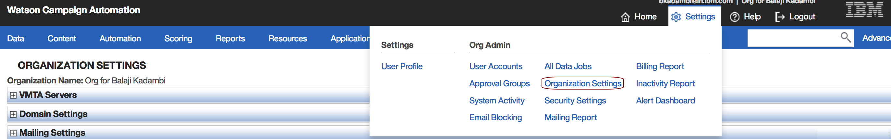
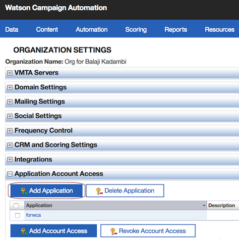
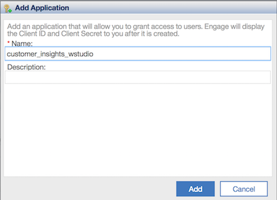

# Determine target audience and run marketing campaigns

A business runs marketing campaigns to promote products with the objective of boosting revenues. The campaigns need to be run on appropriate audiences for maximum impact. A consumer not interested in a product will ignore the campaign offer.

There are two steps to running a marketing campaign:

* Identifying the target audience - The target audience can be determined by analyzing the purchases and browsing history of customers. This will help identify customers who could be interested in a product.  

* Run campaigns(e-mail, sms, phone etc.) on target audience to have maximum impact.

In this pattern, the following aspects are covered:
* Identifying the target audience to run a campaign in a certain product category.
* Run an E-mail campaign for the target audience.

The customer demographics and sales data available [here](https://dataplatform.ibm.com/exchange/public/entry/view/f8ccaf607372882403a37d9019b3abf4) is used to demonstrate the above. The sales data includes multiple categories of products. For this pattern, we demonstrate identifying the target audience and running a campaign for *Canned Foods*.

When the reader has completed this pattern, they will understand how to:
* Create and run a Jupyter notebook in Watson Studio.
* Use Object Storage to access data files.
* Use Python Pandas to derive insights and come up with a target audience based on the customer purchase data.
* Integrate with Watson Campaign Automation to run a campaign on the target audience.

The intended audience for this journey are Developers and Data Scientists who want to build an end to end marketing campaign solution for a business.

1. The Object storage stores the data.
2. Data is utilized as csv files.
3. The Jupyter notebook processes the data and generates the target audience.
4. The Jupyter notebook is powered by Spark.
5. The target audience information is sent to Watson campaign automation(WCA) to run campaigns.

## Included components

* [IBM Watson Studio](https://www.ibm.com/cloud/watson-studio): Analyze data using RStudio, Jupyter, and Python in a configured, collaborative environment that includes IBM value-adds, such as managed Spark.

* [IBM Cloud Object Storage](https://console.bluemix.net/catalog/infrastructure/cloud-object-storage): An IBM Cloud service that provides an unstructured cloud data store to build and deliver cost effective apps and services with high reliability and fast speed to market.

* [Watson campaign automation](https://www.ibm.com/in-en/marketplace/digital-marketing-and-lead-management): Smarter marketing automation across all digital channels, powered by Watson.

## Featured technologies

* [Data Science](https://medium.com/ibm-data-science-experience/): Systems and scientific methods to analyze structured and unstructured data in order to extract knowledge and insights.

* [Marketing automation](https://en.wikipedia.org/wiki/Marketing_automation): Software platforms and technologies designed for marketing departments and organizations to more effectively market on multiple channels online (such as email, social media, websites, etc.) and automate repetitive tasks.

# Watch the Video

TODO

# Steps

Follow these steps to setup and run this developer journey. The steps are
described in detail below.

1. [Sign up for Watson Studio](#1-sign-up-for-watson-studio)
1. [Setup and configure Watson Campaign Automation for Email campaigns](#2-setup-and-configure-watson-campaign-automation-for-email-campaigns)
1. [Create the notebook](#3-create-the-notebook)
1. [Add the data](#4-add-the-data)
1. [Update the notebook with service credentials](#5-update-the-notebook-with-service-credentials)
1. [Run the notebook](#6-run-the-notebook)
1. [Analyze the results](#7-analyze-the-results)

## 1. Sign up for Watson Studio

Sign up for IBM's [Watson Studio](https://datascience.ibm.com/). By signing up for the Watson Studio, two services will be created - Spark and ObjectStore in your Bluemix account. 

## 2. Setup and configure Watson Campaign Automation for Email campaigns

### Add application access to Watson Campaign Automation

Login to the Watson Campaign Automation instance. Go to `Settings` and select `Organization Settings`.

Goto `Application Account Access` and click `Add Application`.

Add an application name and click `Add`.

Click on 

