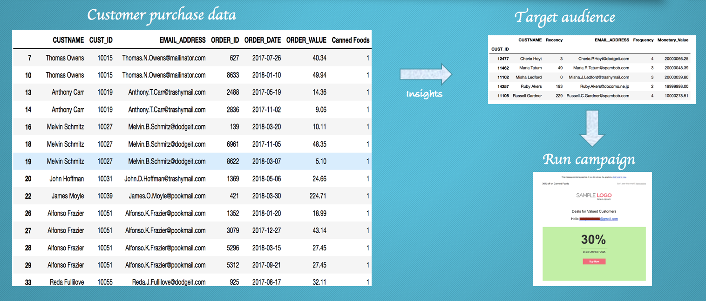

# Determine target consumers and run marketing campaigns

A business runs marketing campaigns promoting products that can lead to purchases and boost revenues. 

There are two steps to running a marketing campaign:

* Identifying the target audience - The target audience can be determined by analyzing the purchases and browsing history of customers.  

* Run campaigns(e-mail, sms, phone etc.) on target audience.

When the reader has completed this pattern, they will understand how to:
* Create and run a Jupyter notebook in Watson Studio.
* Use Object Storage to access data files.
* Use Python Pandas to derive insights and come up with a target audience based on the customer purchase data.
* Integrate with Watson Campaign Automation to run a campaign on the target audience.

